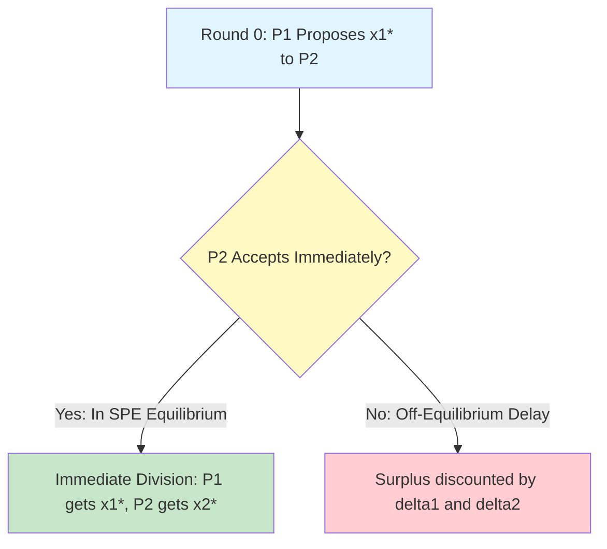

# GenPark Rubinstein Alternating-Offers Bargaining Skill

Infinite-horizon Rubinstein alternating-offers bargaining protocol determining Subgame Perfect Equilibrium payoff splits.

Discover more at [GenPark](https://genpark.ai) and the [GenPark MCP Catalog](https://genpark.ai/mcp).

## Features
- Closed-form Subgame Perfect Equilibrium (SPE) calculation.
- First-mover advantage and asymmetric patience (discount factor) modeling.
- Zero external dependencies.
